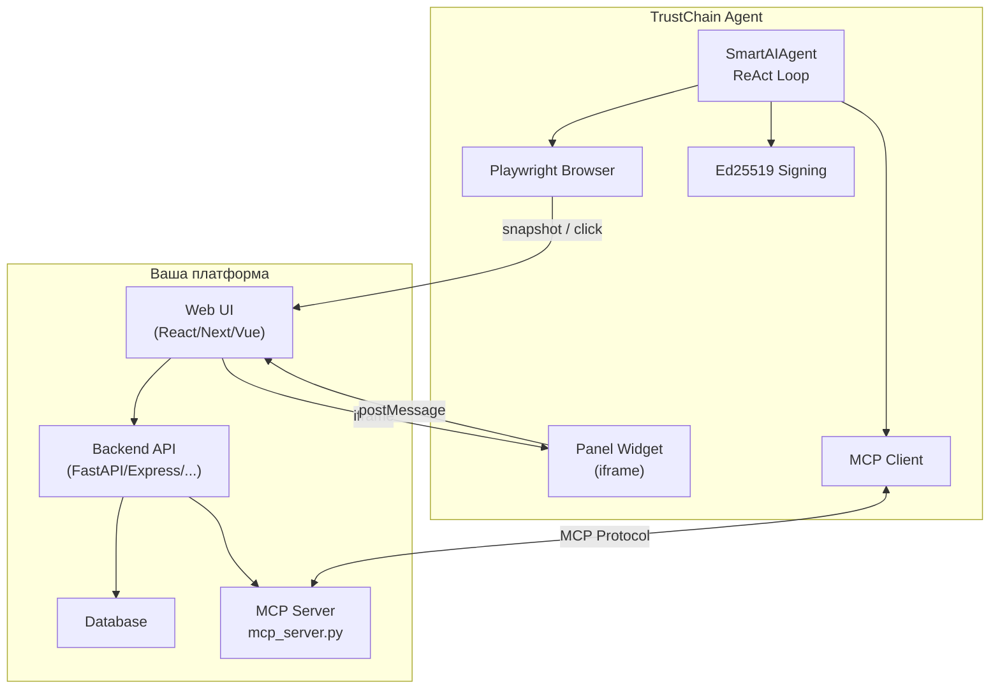

# TrustChain Agent — Integration Standard v1.1

**Стандарт интеграции бизнес-платформ с криптографически верифицированным AI-агентом**

---

## Краткое описание

TrustChain Agent — универсальный AI-ассистент, встраиваемый в любую бизнес-платформу. Агент подключается к вашему приложению через **Model Context Protocol (MCP)**, автоматически обнаруживает доступные операции и данные, а также может **видеть и управлять** интерфейсом через встроенный Playwright-браузер.

**Что вы получаете:**

| Возможность | Описание |
|-------------|----------|
| 🔌 Plug-and-play | Агент автоматически обнаруживает все tools вашей платформы |
| 🔐 Криптоверификация | Каждое действие агента подписывается Ed25519 |
| 👁️ Визуальный доступ | Агент видит страницу через Playwright (snapshot, screenshot, click) |
| 💬 Встраиваемый чат | Готовый sidebar-виджет через `<iframe>` |
| 🔄 Двусторонний обмен | postMessage API для управления UI хост-страницы |

---

## Содержание

1. [Quick Start — 3 шага](#quick-start)
2. [Архитектура](#архитектура)
3. [MCP Server — что реализовать](#mcp-server)
4. [Встраивание Panel Widget](#встраивание-panel-widget)
5. [postMessage API](#postmessage-api)
6. [Agent → Page Actions](#agent--page-actions)
7. [Playwright — визуальный доступ](#playwright--визуальный-доступ)
8. [Безопасность](#безопасность)
9. [Типовые паттерны](#типовые-паттерны)
10. [Тестирование](#тестирование)
11. [Troubleshooting](#troubleshooting)

---

## Quick Start

### Шаг 1. Создайте MCP Server

MCP Server — отдельный HTTP-сервис, который экспортирует операции вашей платформы. Минимальный пример:

```python
from fastapi import FastAPI
import uvicorn, httpx

BACKEND = "http://localhost:8000"  # URL вашего API
app = FastAPI()

@app.post("/tools/list")
async def list_tools():
    return {"tools": [
        {
            "name": "list_items",
            "description": "Получить список элементов",
            "inputSchema": {
                "type": "object",
                "properties": {
                    "filter": {"type": "string", "description": "Фильтр (опционально)"}
                }
            }
        },
        {
            "name": "update_item",
            "description": "Обновить элемент по ID",
            "inputSchema": {
                "type": "object",
                "properties": {
                    "id": {"type": "string"},
                    "data": {"type": "object"}
                },
                "required": ["id"]
            }
        }
    ]}

@app.post("/tools/call")
async def call_tool(request: dict):
    name = request["name"]
    args = request.get("arguments", {})
    async with httpx.AsyncClient() as client:
        if name == "list_items":
            r = await client.get(f"{BACKEND}/api/items", params=args)
        elif name == "update_item":
            r = await client.patch(f"{BACKEND}/api/items/{args['id']}", json=args.get("data", {}))
        else:
            return {"error": f"Unknown tool: {name}"}
        return {"result": {"content": [{"type": "text", "text": r.text}]}}

@app.get("/health")
def health():
    return {"status": "ok"}

if __name__ == "__main__":
    uvicorn.run(app, host="0.0.0.0", port=7323)
```

### Шаг 2. Встройте виджет

Добавьте `<iframe>` на вашу страницу:

```html
<iframe
  src="http://<agent-host>:5173/panel?instance=myapp&mcp=http://localhost:7323&context=dashboard&theme=dark&hostUrl=http://localhost:3000/dashboard"
  class="w-full h-full border-0"
  title="TrustChain Agent"
  allow="clipboard-write"
/>
```

### Шаг 3. Запустите и проверьте

```bash
# Терминал 1: ваш backend
python server.py

# Терминал 2: MCP Server
python mcp_server.py

# Терминал 3: TrustChain Agent
cd TrustChain_Agent && npm run dev

# Терминал 4 (опционально): Playwright для визуального доступа
npx @playwright/mcp@latest --port 8931 --headless
```

Откройте вашу платформу → агент в правой панели автоматически подключится к MCP и покажет доступные навыки.

---

## Архитектура



**Потоки данных:**

| Поток | Направление | Протокол |
|-------|-------------|----------|
| Данные платформы | MCP Server → Agent | MCP (HTTP/SSE) |
| UI-действия | Agent → Host Page | postMessage или Playwright |
| Навыки / контекст | Host Page → Panel | postMessage или URL params |
| Визуальный доступ | Agent → Playwright → Browser | Streamable HTTP MCP |

---

## MCP Server

### Что это

MCP Server — HTTP-сервис, который экспортирует возможности вашей платформы для агента. Реализуйте два эндпоинта:

| Эндпоинт | Метод | Назначение |
|----------|-------|-----------|
| `/tools/list` | POST | Список доступных операций |
| `/tools/call` | POST | Выполнение операции |
| `/resources/list` | POST | Список доступных данных (опционально) |
| `/resources/read` | POST | Чтение данных (опционально) |
| `/health` | GET | Проверка доступности (рекомендуется) |

### Формат Tool

```json
{
  "name": "create_order",
  "description": "Создать заказ на поставку оборудования",
  "inputSchema": {
    "type": "object",
    "properties": {
      "product_id": { "type": "string", "description": "ID товара из каталога" },
      "quantity": { "type": "integer", "minimum": 1 },
      "priority": { "type": "string", "enum": ["normal", "urgent"] }
    },
    "required": ["product_id", "quantity"]
  }
}
```

> [!IMPORTANT]
> **Именование tools**: агент автоматически добавляет префикс `mcp_{serverId}_` к каждому tool. Например, `create_order` → `mcp_myapp_create_order`. Это предотвращает конфликты имён при подключении нескольких платформ.

### Формат ответа `/tools/call`

```json
{
  "result": {
    "content": [
      { "type": "text", "text": "{\"order_id\": \"ORD-123\", \"status\": \"created\"}" }
    ]
  }
}
```

### Формат Resource

```json
{
  "uri": "order://ORD-123",
  "name": "Заказ ORD-123",
  "mimeType": "application/json",
  "description": "Заказ: насос Grundfos CR 10-4, 5 шт., статус: в обработке"
}
```

### Требования

| Категория | Обязательно | Рекомендуется |
|-----------|:---:|:---:|
| `/tools/list` + `/tools/call` | ✅ | |
| `/health` | | ✅ |
| `/resources/list` + `/resources/read` | | ✅ |
| Аутентификация (API key) | | ✅ |
| Rate limiting | | ✅ |
| CORS headers | | ✅ |

---

## Встраивание Panel Widget

TrustChain Agent предоставляет `/panel` — компактный sidebar-виджет для встраивания через `<iframe>`.

### URL-параметры

```
/panel?instance=myapp&mcp=http://localhost:7323&context=dashboard&theme=dark&hostUrl=http://localhost:3000/dashboard
```

| Параметр | Обязателен | Описание |
|----------|:---:|-----------| 
| `instance` | ✅ | Namespace для изоляции данных: `myapp`, `crm`, `erp` | 
| `mcp` | — | URL MCP сервера для авто-подключения |
| `context` | — | Контекст страницы — определяет навыки на welcome screen |
| `hostUrl` | — | URL текущей страницы хост-приложения (для Playwright навигации) |
| `system` | — | Base64-кодированный system prompt |
| `theme` | — | `dark` (по умолчанию) / `light` |
| `lang` | — | `ru` / `en` / `kz` |
| `title` | — | Заголовок панели |

> [!TIP]
> Параметр `hostUrl` передаётся **динамически** — при каждой навигации пользователя обновляйте `src` iframe с актуальным URL. Это позволяет агенту всегда знать, какую страницу он «видит».

### Пример встраивания (React/Next.js)

```tsx
const AgentPanel = ({ currentPath }: { currentPath: string }) => {
  const hostUrl = encodeURIComponent(`http://localhost:3000${currentPath}`);
  
  return (
    <iframe
      src={`http://localhost:5173/panel?instance=myapp&context=dashboard&mcp=http://localhost:7323&theme=dark&hostUrl=${hostUrl}`}
      className="w-full h-full border-0"
      title="TrustChain Agent"
      allow="clipboard-write"
    />
  );
};
```

### Приоритет навыков

Панель определяет skills (кнопки быстрых действий) в следующем порядке:

1. **postMessage skills** — динамические навыки от хост-страницы (высший приоритет)
2. **MCP tools** — первые 5 инструментов от MCP сервера
3. **context fallback** — статические навыки по значению `?context=`
4. **generic** — приглашение к диалогу

---

## postMessage API

Двусторонний обмен сообщениями между хост-страницей и панелью агента.

### Host → Panel

| Тип сообщения | Назначение | Payload |
|---------------|-----------|---------|
| `trustchain:skills` | Передать контекстные навыки | `{ skills: [{ label, prompt, color }] }` |
| `trustchain:query` | Заполнить поле ввода | `{ text: "запрос" }` |
| `trustchain:auto_query` | Отправить запрос автоматически | `{ text: "запрос" }` |
| `trustchain:action_result` | Подтверждение выполнения действия | `{ action, success }` |

### Panel → Host

| Тип сообщения | Назначение | Payload |
|---------------|-----------|---------|
| `trustchain:response` | Агент завершил ответ | `{ text, hasArtifacts }` |
| `trustchain:action` | Агент управляет UI страницы | `{ action, payload }` |

### Пример: динамические навыки

```javascript
// При выборе элемента — обновить навыки панели
const panelFrame = document.getElementById('trustchain-panel');
panelFrame.contentWindow.postMessage({
  type: 'trustchain:skills',
  skills: [
    { label: 'Анализ выбранного элемента', prompt: 'Проанализируй элемент X', color: '#a78bfa' },
    { label: 'Сравнить с аналогами', prompt: 'Найди аналоги и сравни', color: '#06b6d4' },
    { label: 'Сгенерировать отчёт', prompt: 'Создай отчёт по элементу X', color: '#34d399' },
  ]
}, '*');
```

---

## Agent → Page Actions

Агент может управлять содержимым хост-страницы двумя способами:

### Layer 1: Structured Protocol (рекомендуемый)

Для **зарегистрированных** действий — быстро, детерминистично, без визуального overhead.

**Хост-страница декларирует** доступные действия и обрабатывает их:

```typescript
// layout.tsx — обработка действий от агента
window.addEventListener('message', (e) => {
  if (e.data?.type !== 'trustchain:action') return;
  
  const { action, payload } = e.data;
  
  switch (action) {
    case 'navigate':
      router.push(payload.target);
      break;
    case 'select_entity':
      store.setSelected(payload.entityType, payload.entityId);
      break;
    case 'refresh_data':
      store.reload();
      break;
  }
  
  // Подтверждение
  iframeRef.current?.contentWindow?.postMessage({
    type: 'trustchain:action_result', action, success: true
  }, '*');
});
```

**Агент вызывает** через MCP tool `page_action`:

```json
{
  "name": "page_action",
  "arguments": {
    "action": "navigate",
    "payload": { "target": "/dashboard" }
  }
}
```

**Типовые действия:**

| Action | Payload | Эффект |
|--------|---------|--------|
| `navigate` | `{ target: "/orders" }` | Навигация по роутеру |
| `select_entity` | `{ entityType: "order", entityId: "ORD-123" }` | Выбор элемента |
| `focus_entity` | `{ entityType: "order", entityId: "ORD-123" }` | Выбор + навигация |
| `set_view` | `{ mode: "table" }` | Переключить вид |
| `refresh_data` | `{}` | Обновить данные |

### Layer 2: Playwright (универсальный)

Для **произвольных** действий на любой веб-странице — без привязки к конкретной платформе.

```bash
# Запуск Playwright MCP сервера
npx @playwright/mcp@latest --port 8931 --headless
```

Агент автоматически обнаруживает Playwright и получает инструменты:

| Tool | Описание |
|------|----------|
| `browser_navigate` | Навигация на URL |
| `browser_snapshot` | Accessibility tree страницы (экономит токены) |
| `browser_click` | Клик по элементу (ref из snapshot) |
| `browser_type` | Ввод текста в поле |
| `browser_screenshot` | Скриншот страницы |
| `browser_evaluate` | Выполнить JavaScript |

### Когда что использовать

| Задача | Layer | Почему |
|--------|-------|--------|
| Навигация к разделу | Layer 1 | Быстро, надёжно |
| Выделение элемента | Layer 1 | Детерминистично |
| Заполнение формы | Layer 2 | Гибко, без доп. кода |
| Чтение данных со страницы | Layer 2 | Универсально |
| Клик по кнопке без API | Layer 2 | Fallback |

---

## Безопасность

### Криптографическая подпись

TrustChain Agent подписывает каждый вызов tool:

```json
{
  "tool": "update_item",
  "arguments": { "id": "ITEM-42", "data": { "status": "approved" } },
  "signature": "ed25519:a7f3b2c8e91d4506...",
  "timestamp": "2026-02-08T15:45:00Z",
  "agent_id": "trustchain-agent-001"
}
```

Ваш MCP Server может:
- **Проверять подпись** — убедиться что запрос от легитимного агента
- **Логировать в audit trail** — сохранить подпись для compliance
- **Отклонять неподписанные запросы**

### Авторизация

Рекомендуемая схема:

```json
{
  "id": "your-platform",
  "name": "Your Platform",
  "url": "http://localhost:7323",
  "transport": "http",
  "apiKey": "sk-your-api-key-here",
  "enabled": true
}
```

Разные уровни доступа:
- **read-only** — агент только читает данные
- **full-access** — агент может создавать и изменять записи
- **admin** — полный доступ включая удаление

---

## Типовые паттерны

### Паттерн 1: CRUD

Для любой сущности экспортируйте 4 базовых tool:

```
list_{entity}    — получить список (с фильтрами)
get_{entity}     — получить одну запись по ID
create_{entity}  — создать новую запись
update_{entity}  — обновить запись
```

### Паттерн 2: Аналитика

```
calculate_metrics  — вычислить KPI за период
generate_report    — создать отчёт (PDF/Excel)
forecast_{metric}  — прогноз на основе исторических данных
```

### Паттерн 3: AI-усиленные операции

Если ваша платформа имеет собственные AI-модели:

```
ai_analyze_{entity}   — AI-анализ элемента
ai_suggest_{field}     — Авто-заполнение полей
ai_classify_{entity}   — Автоматическая классификация
```

---

## Тестирование

### Unit-тесты MCP Server

```python
import pytest

@pytest.mark.asyncio
async def test_list_tools():
    """MCP Server должен экспортировать хотя бы один tool"""
    response = await client.post("/tools/list")
    data = response.json()
    assert "tools" in data
    assert len(data["tools"]) > 0

@pytest.mark.asyncio
async def test_call_tool():
    """Вызов tool должен вернуть result.content"""
    response = await client.post("/tools/call", json={
        "name": "list_items",
        "arguments": {}
    })
    data = response.json()
    assert "result" in data
    assert "content" in data["result"]
```

### Чек-лист интеграции

- [ ] MCP Server запускается и отвечает на `/health`
- [ ] `/tools/list` возвращает массив tools с `name`, `description`, `inputSchema`
- [ ] `/tools/call` корректно вызывает backend API и возвращает результат
- [ ] `<iframe>` с панелью отображается на хост-странице
- [ ] Агент обнаруживает tools (видно в логе консоли: `[MCP] Connected to ...`)
- [ ] Пользователь может задать вопрос и получить ответ с данными из MCP
- [ ] (опц.) postMessage skills обновляются при смене контекста
- [ ] (опц.) page_action обрабатывается хост-страницей
- [ ] (опц.) Playwright snapshot возвращает accessibility tree страницы

---

## Troubleshooting

| Симптом | Причина | Решение |
|---------|---------|---------|
| Агент не видит tools | MCP Server не запущен или недоступен | Проверьте `curl http://localhost:7323/health` |
| CORS ошибка в консоли | Браузер блокирует cross-origin запросы | Добавьте CORS headers в MCP Server или используйте Vite proxy |
| `about:blank` при snapshot | Playwright не навигировал на страницу | Убедитесь что `hostUrl` передаётся в iframe URL |
| Tools обнаружены, но не вызываются | Ошибка в `/tools/call` | Проверьте логи MCP Server, формат ответа `result.content` |
| Панель не загружается | TrustChain Agent dev server не запущен | Запустите `npm run dev` в папке TrustChain_Agent |
| `mcp_xxx_tool` не найден | Неверный `serverId` в конфигурации | Tool name = `mcp_{config.id}_{tool.name}` |

---

**TrustChain Agent Integration Standard v1.1** • [Model Context Protocol](https://modelcontextprotocol.io/) • Ed25519 Cryptographic Verification
