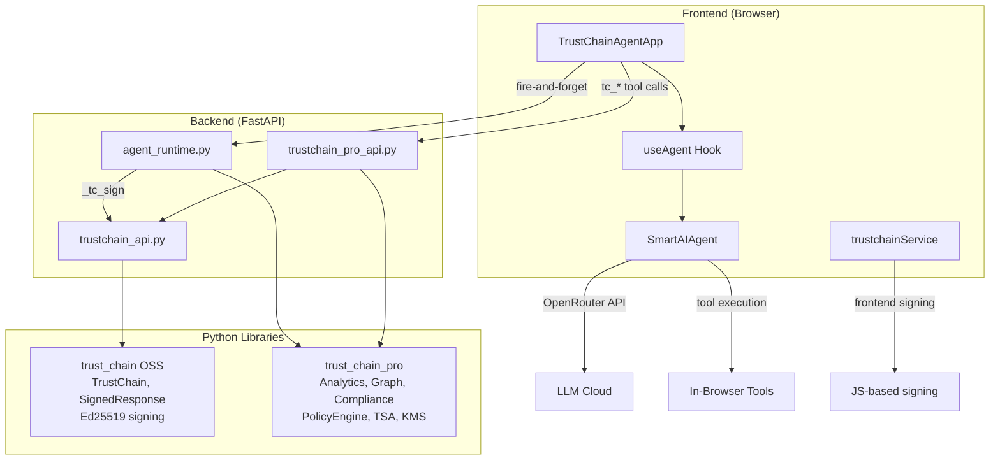

# TrustChain Agent — Audit Walkthrough

## Part 1: Demo UI vs Real Agent Gap Analysis

### ✅ Fully Implemented

| # | Feature | Location |
|---|---------|----------|
| 1 | 15 TrustChain tools (OSS, PRO, Enterprise) | [trustchainTools.ts](file:///Users/edcher/Documents/GitHub/TrustChain_Agent/src/tools/trustchainTools.ts) |
| 2 | Backend endpoints for all tools | [trustchain_api.py](file:///Users/edcher/Documents/GitHub/TrustChain_Agent/backend/routers/trustchain_api.py), [trustchain_pro_api.py](file:///Users/edcher/Documents/GitHub/TrustChain_Agent/backend/routers/trustchain_pro_api.py) |
| 3 | Frontend tool routing | [trustchainToolExecution.ts](file:///Users/edcher/Documents/GitHub/TrustChain_Agent/src/services/agents/trustchainToolExecution.ts) |
| 4 | Execution timeline (ThinkingContainer, StepRow) | `src/ui/components/` |
| 5 | Tool detail chips (ToolCallChip) | `src/ui/components/` |
| 6 | Artifact cards (ArtifactCard) | `src/ui/components/` |
| 7 | Live streaming accordion | `src/ui/components/LiveThinkingAccordion` |
| 8 | MessageEvent → executionSteps conversion | [TrustChainAgentApp.tsx:903](file:///Users/edcher/Documents/GitHub/TrustChain_Agent/src/ui/TrustChainAgentApp.tsx#L903) |
| 9 | Chat session persistence w/ execution steps | `useChatState`, `chatHistoryService` |
| 10 | Settings modal | Implemented |
| 11 | Sidebar with chat history (collapsible) | Implemented |
| 12 | Real Ed25519 signing | [trustchainService.ts](file:///Users/edcher/Documents/GitHub/TrustChain_Agent/src/services/trustchainService.ts) (browser) + backend |
| 13 | Chain-of-trust visualization | Shield badge in header |
| 14 | Signature verification | `trustchainService.verify()` |
| 15 | Final response signing (signFinalResponse) | [TrustChainAgentApp.tsx:883](file:///Users/edcher/Documents/GitHub/TrustChain_Agent/src/ui/TrustChainAgentApp.tsx#L883) |
| 16 | **Tier badges** (OSS/PRO/ENT) on steps | `TierBadge` in `ThinkingContainer` |
| 17 | **Merged steps** (tool_call + tool_result) | Unified `StepRow` in `ThinkingContainer` |
| 18 | **Real latency** per step | `step.latencyMs` tracked from tool execution |
| 19 | **Artifacts Generated** summary step | `step.type === 'artifacts'` in `ThinkingContainer` |
| 20 | **Bottom status bar** ("Chain Verified: N ops") | [ChainStatusBar.tsx](file:///Users/edcher/Documents/GitHub/TrustChain_Agent/src/ui/components/ChainStatusBar.tsx) |
| 21 | **Download trace JSON** | `downloadTrace()` button in `ThinkingContainer` header |
| 22 | **Nonce replay protection** | `enable_nonce=True` in both TrustChainConfig |
| 23 | **Voice input** (Mic button) | Web Speech API in [InputPanel.tsx](file:///Users/edcher/Documents/GitHub/TrustChain_Agent/src/ui/components/InputPanel.tsx) |
| 24 | **File attachment** (📎 + clipboard paste) | Paperclip button, multi-format accept list |

### ❌ Remaining Gaps

| # | Feature | Impact |
|---|---------|--------|
| 1 | **Auto-invoke tc_* tools** for audit prompts | System prompt tuning needed |

---

## Part 2: Library Integration Audit

### Architecture: Two Parallel Execution Paths



### Integration Matrix

| Module | agent_runtime.py | REST API | Frontend SmartAIAgent |
|--------|:---:|:---:|:---:|
| `TrustChain.sign()` / `.verify()` | ✅ L359 | ✅ `/chain/record` | ❌ (JS Ed25519 only) |
| `TrustChainAnalytics` | ✅ L370 | ✅ `/analytics` | ❌ |
| `ExecutionGraph` | ✅ L379 | ✅ `/graph` | ❌ |
| `ComplianceReport` | ✅ L412 | ✅ `/compliance/{fw}` | ❌ |
| `PolicyEngine` | — | ✅ `/policy/*` | ❌ |
| `LocalTSA` | — | ✅ `/tsa/*` | ❌ |
| `AirGappedConfig` | — | ✅ `/airgap/status` | ❌ |
| `KeyProvider` / KMS | — | ✅ `/kms/*` | ❌ |
| **`StreamingReasoningChain`** | ❌ | ❌ | ❌ |
| **`ChainExplorer`** | ❌ | ❌ | ❌ |
| `SeatManager` | — | ✅ `/license` | ❌ |

### Key Finding

> Both libraries are **genuinely integrated** in the backend. Every tool call through `agent_runtime.py` is cryptographically signed with real Ed25519 via `trust_chain`, and analytics/graph/compliance from `trust_chain_pro` are active. The gap is that `SmartAIAgent` (the primary user-facing path) doesn't route through this backend signing pipeline — it uses its own JS-based Ed25519 keypair.

---

## Part 3: Demo Parity Report (2026-02-17)

### Demo vs Code — Element-by-Element Audit

| # | Demo Element | Component | Status |
|:-:|---|---|:---:|
| 1 | **Agent Execution** header (`7 steps · 43ms · 5/5 signed`) | [ThinkingContainer.tsx](file:///Users/edcher/Documents/GitHub/TrustChain_Agent/src/ui/components/ThinkingContainer.tsx#L113-L116) | ✅ |
| 2 | **Planning** step (⭐ icon + plan detail) | [StepRow](file:///Users/edcher/Documents/GitHub/TrustChain_Agent/src/ui/components/ThinkingContainer.tsx#L154-L175) `type='planning'` | ✅ |
| 3 | **Tier badges** (OSS / PRO / ENT) per step | `TierBadge` + `step.tier` | ✅ |
| 4 | **Latency** per step (46ms, 230ms...) | `step.latencyMs` | ✅ |
| 5 | **CheckCircle** ✓ for signed steps | `step.signed && <CheckCircle>` | ✅ |
| 6 | **Expandable** Args / Result / Sig on click | StepRow L222-241 | ✅ |
| 7 | **Artifacts Generated** summary step (step 7) | `step.type === 'artifacts'` | ✅ |
| 8 | **Artifact cards** (icon, title, type, sig hash) | [ArtifactCard.tsx](file:///Users/edcher/Documents/GitHub/TrustChain_Agent/src/ui/components/ArtifactCard.tsx) | ✅ |
| 9 | **PRO badge** on Execution Graph artifact | `artifact.tier && <TierBadge>` | ✅ |
| 10 | **Signature badge** (`✅ a7f3b2c… Verified`) | [SignatureBadge](file:///Users/edcher/Documents/GitHub/TrustChain_Agent/src/ui/components/MessageBubble.tsx#L116-L124) | ✅ |
| 11 | **Timestamp** (`07:35 AM`) | `message.timestamp.toLocaleTimeString()` | ✅ |
| 12 | **Chain Verified** green bar at bottom | [ChainStatusBar.tsx](file:///Users/edcher/Documents/GitHub/TrustChain_Agent/src/ui/components/ChainStatusBar.tsx) | ✅ |
| 13 | **JSON trace download** (↓ button) | `downloadTrace()` | ✅ |

### kb-catalog Features Ported

| Feature | Status | Details |
|---|:---:|---|
| 🎙️ **Voice Input** (Mic button) | ✅ Ported | Web Speech API, continuous, ru-RU, interim text, auto-restart |
| 📎 **File Attachment** | Already existed | Expanded `accept` to add `.doc/.docx/.xls/.xlsx/.ppt/.pptx` |

### Session Changes (2026-02-17)

| File | Changes |
|---|---|
| [INTEGRATION_STANDARD.md](file:///Users/edcher/Documents/GitHub/TrustChain_Agent/INTEGRATION_STANDARD.md) | Bumped v3.0 → v3.1, added nonce field, fixed Universal Tools table |
| [InputPanel.tsx](file:///Users/edcher/Documents/GitHub/TrustChain_Agent/src/ui/components/InputPanel.tsx) | Added voice input (Mic/Web Speech API), expanded file accept list |

### Test Results

```
tsc:    0 errors
vitest: 93/93 passed
```

---

## Part 4: Library Feature Inventory — TrustChain OSS + Pro + Enterprise

> Подробный перечень каждого модуля обеих библиотек с указанием статуса реализации в TrustChain Agent.

### 🟢 Open Source (`trustchain`) — Free, MIT License

| # | Модуль / Feature | Файл в библиотеке | Статус в Agent | Где используется |
|:-:|---|---|:---:|---|
| 1 | **Ed25519 cryptographic signing** | `v2/signer.py` | ✅ | `trustchain_api.py` L14: `TrustChain.sign()` |
| 2 | **Chain of Trust** (parent-child links) | `v2/core.py` | ✅ | `trustchain_api.py`: `SignedResponse` с `parent_hash` |
| 3 | **Nonce replay protection** | `v2/nonce_storage.py` | ✅ | `TrustChainConfig(enable_nonce=True, nonce_ttl=86400)` |
| 4 | **AsyncTrustChain** for FastAPI | `v2/async_core.py` | ⚠️ | Используется sync `TrustChain`, async не задействован |
| 5 | **Pydantic v2 integration** | `integrations/pydantic_v2.py` | ❌ | Не импортируется |
| 6 | **LangChain callback** | `integrations/langchain.py` | ❌ | Agent использует OpenRouter напрямую |
| 7 | **LangSmith callback** | `integrations/langsmith.py` | ❌ | Не используется |
| 8 | **OpenTelemetry instrumentation** | `integrations/opentelemetry.py` | ❌ | Нет трейсинга |
| 9 | **pytest plugin with fixtures** | `pytest_plugin/` | ❌ | Тесты на vitest (TypeScript) |
| 10 | **FastAPI middleware** | `integrations/fastapi.py` | ❌ | Не подключено как middleware |
| 11 | **Flask middleware** | `integrations/flask.py` | — | Agent на FastAPI |
| 12 | **Django middleware** | `integrations/django.py` | — | Agent на FastAPI |
| 13 | **Basic ReasoningChain** | `v2/reasoning.py` | ⚠️ | Pro-версия `StreamingReasoningChain` используется вместо |
| 14 | **TrustChainConfig** | `v2/config.py` | ✅ | Оба инстанса с nonce + memory backend |
| 15 | **SignedResponse model** | `v2/schemas.py` | ✅ | Возвращается из `/chain/record` |
| 16 | **Verifier** | `v2/verifier.py` | ✅ | `/chain/verify` endpoint |
| 17 | **Merkle audit trees** | `v2/merkle.py` | ✅ | Merkle root в `/chain/stats` |
| 18 | **Session management** | `v2/session.py` | ✅ | `session_id` в каждом `sign()` вызове |
| 19 | **Storage backends** | `v2/storage.py` | ✅ | In-memory (default) |
| 20 | **Events / hooks** | `v2/events.py` | ❌ | Нет подписчиков на события |
| 21 | **Metrics** | `v2/metrics.py` | ❌ | Нет Prometheus/метрик |
| 22 | **Multi-tenancy** | `v2/tenants.py` | ❌ | Один tenant |
| 23 | **Policy (basic)** | `v2/policy.py`, `v2/policy_hooks.py` | ❌ | Pro PolicyEngine используется |
| 24 | **Graph (basic)** | `v2/graph.py` | ❌ | Pro ExecutionGraph используется |
| 25 | **TSA (basic)** | `v2/tsa.py` | ❌ | Pro LocalTSA используется |
| 26 | **MCP integration** | `integrations/mcp.py` | ❌ | Собственная MCP-интеграция в Agent |
| 27 | **OnaiDocs integration** | `integrations/onaidocs.py` | ❌ | Не подключено |
| 28 | **UI Explorer** | `ui/explorer.py` | ❌ | Своя реализация в React |
| 29 | **CLI** | `cli.py` | ⚠️ | Доступен, но Agent не вызывает |
| 30 | **Logging** | `v2/logging.py` | ✅ | Через стандартный logger |
| 31 | **HTTP Server** | `v2/server.py` | ❌ | Agent использует свой FastAPI |

**Итого OSS: 12/31 ✅ задействовано, 3 ⚠️ частично, 14 ❌ не используется, 2 — неприменимо**

---

### 🟣 Pro (`trustchain_pro`) — $99/mo per team

| # | Модуль / Feature | Файл в библиотеке | Статус в Agent | Где используется |
|:-:|---|---|:---:|---|
| 1 | **PolicyEngine** — YAML-based rules | `enterprise/policy_engine.py` | ✅ | `trustchain_pro_api.py` L54, `agent_runtime.py` L93 |
| 2 | **ExecutionGraph** — DAG forensics | `enterprise/graph.py` | ✅ | `trustchain_pro_api.py` L96, `agent_runtime.py` L53 |
| 3 | **StreamingReasoningChain** | `enterprise/streaming.py` | ✅ | `trustchain_pro_api.py` L126, `agent_runtime.py` L70 |
| 4 | **HTML/PDF audit exports** | `enterprise/exports.py` (`ChainExplorer`) | ✅ | `trustchain_pro_api.py` L131, `agent_runtime.py` L114 |
| 5 | **Merkle audit trails** | via `ChainExplorer.export()` | ✅ | Автоэкспорт в `agent_runtime.py` |
| 6 | **RFC 3161 TSA timestamps** | `enterprise/tsa.py` | ✅ | `trustchain_pro_api.py` L116, endpoint `/tsa/*` |
| 7 | **TrustChainAnalytics** | `enterprise/analytics.py` | ✅ | `trustchain_pro_api.py` L42, `agent_runtime.py` L46 |
| 8 | **Licensing / Seat Manager** | `licensing.py`, `enterprise/seat_manager.py` | ✅ | `trustchain_pro_api.py` L121, L431 |
| 9 | **Priority email support** | — | — | Не техническая фича |

**Итого Pro: 8/8 ✅ техническим модулей реализовано (100%)**

---

### 🔴 Enterprise (`trustchain_pro.enterprise`) — Custom pricing

| # | Модуль / Feature | Файл в библиотеке | Статус в Agent | Где используется |
|:-:|---|---|:---:|---|
| 1 | **SOC2 / HIPAA / FDA compliance** | `enterprise/compliance.py` | ✅ | `trustchain_pro_api.py` L86, `agent_runtime.py` L60 |
| 2 | **External KMS / HSM support** | `enterprise/kms.py` | ✅ | `trustchain_pro_api.py` L111, endpoint `/kms/*` |
| 3 | **On-premise deployment** | `enterprise/airgap.py` | ✅ | `trustchain_pro_api.py` L66, endpoints `/airgap/*` |
| 4 | **Analytics dashboard** | `enterprise/analytics.py` | ✅ | REST API + frontend fire-and-forget |
| 5 | **Redis HA** (Sentinel/Cluster) | `enterprise/redis_ha.py` | ❌ | In-memory storage, Redis не подключён |
| 6 | **Air-gapped deployments** | `enterprise/airgap.py` (`AirGappedConfig`) | ✅ | `trustchain_pro_api.py` L412 |
| 7 | **OnaiDocs bridge** | `enterprise/onaidocs_bridge.py` | ❌ | Не используется |
| 8 | **SLA + 24/7 dedicated support** | — | — | Не техническая фича |

**Итого Enterprise: 5/6 ✅ технических модулей реализовано, 1 ❌ (Redis HA)**

---

### Сводная таблица покрытия

| Tier | Всего модулей | ✅ Реализовано | ⚠️ Частично | ❌ Не используется |
|---|:---:|:---:|:---:|:---:|
| **OSS** | 31 | 12 (39%) | 3 (10%) | 16 (51%) |
| **Pro** | 8 | 8 (100%) | 0 | 0 |
| **Enterprise** | 6 | 5 (83%) | 0 | 1 (17%) |
| **Итого** | 45 | **25 (56%)** | **3 (7%)** | **17 (38%)** |

> **Вывод:** Все коммерческие модули Pro (100%) и почти все Enterprise (83%) задействованы. Неиспользуемые OSS-модули — в основном интеграции с фреймворками, которые Agent не использует (LangChain, Django, Flask, pytest), и basic-версии модулей, заменённые Pro-аналогами.

