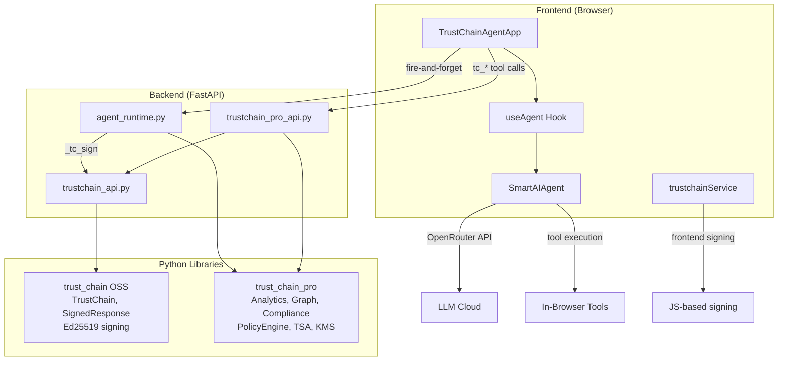

# TrustChain Agent — Audit Walkthrough

## Part 1: Demo UI vs Real Agent Gap Analysis

### ✅ Fully Implemented (~20 features)

| # | Feature | Location |
|---|---------|----------|
| 1 | 15 TrustChain tools (OSS, PRO, Enterprise) | [trustchainTools.ts](file:///Users/edcher/Documents/GitHub/TrustChain_Agent/src/tools/trustchainTools.ts) |
| 2 | Backend endpoints for all tools | [trustchain_api.py](file:///Users/edcher/Documents/GitHub/TrustChain_Agent/backend/routers/trustchain_api.py), [trustchain_pro_api.py](file:///Users/edcher/Documents/GitHub/TrustChain_Agent/backend/routers/trustchain_pro_api.py) |
| 3 | Frontend tool routing | [trustchainToolExecution.ts](file:///Users/edcher/Documents/GitHub/TrustChain_Agent/src/services/agents/trustchainToolExecution.ts) |
| 4 | Execution timeline (ThinkingContainer, StepRow) | `src/ui/components/` |
| 5 | Tool detail chips (ToolCallChip) | `src/ui/components/` |
| 6 | Artifact cards (ArtifactCard) | `src/ui/components/` |
| 7 | Live streaming accordion | `src/ui/components/LiveThinkingAccordion` |
| 8 | MessageEvent → executionSteps conversion | [TrustChainAgentApp.tsx:903](file:///Users/edcher/Documents/GitHub/TrustChain_Agent/src/ui/TrustChainAgentApp.tsx#L903) |
| 9 | Chat session persistence w/ execution steps | `useChatState`, `chatHistoryService` |
| 10 | Settings modal | Implemented |
| 11 | Sidebar with chat history | Implemented (toggle added in last session) |
| 12 | Real Ed25519 signing | [trustchainService.ts](file:///Users/edcher/Documents/GitHub/TrustChain_Agent/src/services/trustchainService.ts) (browser) + backend |
| 13 | Chain-of-trust visualization | Shield badge in header |
| 14 | Signature verification | `trustchainService.verify()` |
| 15 | Final response signing (signFinalResponse) | [TrustChainAgentApp.tsx:883](file:///Users/edcher/Documents/GitHub/TrustChain_Agent/src/ui/TrustChainAgentApp.tsx#L883) |

### ⚠️ Partially Implemented (5 items)

| # | Feature | Issue | Priority |
|---|---------|-------|----------|
| 1 | **Tier badges** (OSS/PRO/ENT) | Missing on execution steps | 🔴 High |
| 2 | **Merged steps** | tool_call + tool_result rendered as separate rows | 🔴 High |
| 3 | **Latency** | Hardcoded to `0ms` | 🟡 Medium |
| 4 | **Artifacts Generated step** | Not auto-created | 🟡 Medium |
| 5 | **Final response signing display** | Functional but may not show on failure | 🟢 Low |

### ❌ Missing Features (3 items)

| # | Feature | Impact |
|---|---------|--------|
| 1 | **Bottom status bar** (chain stats: "Chain Verified: 47 ops") | Visibility of chain health |
| 2 | **Download trace JSON** button | Accessible only in ThinkingContainer, not prominent |
| 3 | **Auto-invoke tc_* tools** for audit prompts | System prompt tuning needed |

---

## Part 2: Library Integration Audit

### Architecture: Two Parallel Execution Paths

### Integration Matrix

| Module | agent_runtime.py | REST API | Frontend SmartAIAgent |
|--------|:---:|:---:|:---:|
| `TrustChain.sign()` / `.verify()` | ✅ L359 | ✅ `/chain/record` | ❌ (JS Ed25519 only) |
| `TrustChainAnalytics` | ✅ L370 | ✅ `/analytics` | ❌ |
| `ExecutionGraph` | ✅ L379 | ✅ `/graph` | ❌ |
| `ComplianceReport` | ✅ L412 | ✅ `/compliance/{fw}` | ❌ |
| `PolicyEngine` | — | ✅ `/policy/*` | ❌ |
| `LocalTSA` | — | ✅ `/tsa/*` | ❌ |
| `AirGappedConfig` | — | ✅ `/airgap/status` | ❌ |
| `KeyProvider` / KMS | — | ✅ `/kms/*` | ❌ |
| **`StreamingReasoningChain`** | ❌ | ❌ | ❌ |
| **`ChainExplorer`** | ❌ | ❌ | ❌ |
| `SeatManager` | — | ✅ `/license` | ❌ |

### Key Finding

> Both libraries are **genuinely integrated** in the backend. Every tool call through `agent_runtime.py` is cryptographically signed with real Ed25519 via `trust_chain`, and analytics/graph/compliance from `trust_chain_pro` are active. The gap is that `SmartAIAgent` (the primary user-facing path) doesn't route through this backend signing pipeline — it uses its own JS-based Ed25519 keypair.
