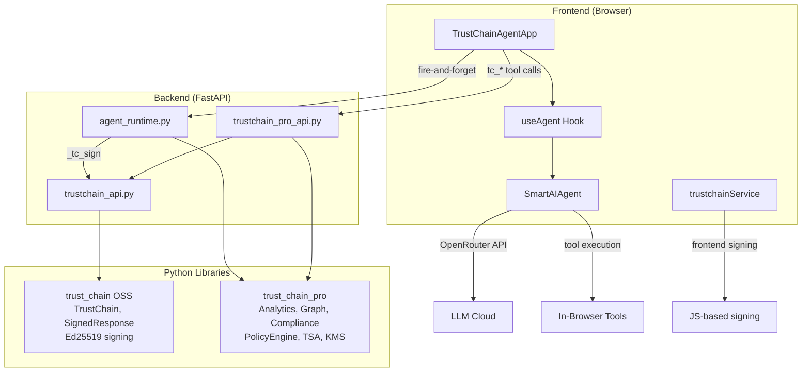
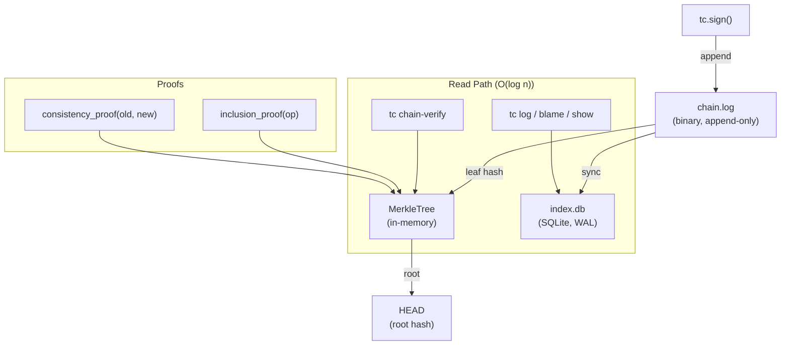

# TrustChain Agent — Audit Walkthrough

## Part 1: Demo UI vs Real Agent Gap Analysis

### ✅ Fully Implemented

| # | Feature | Location |
|---|---------|----------|
| 1 | 15 TrustChain tools (OSS, PRO, Enterprise) | [trustchainTools.ts](file:///Users/edcher/Documents/GitHub/TrustChain_Agent/src/tools/trustchainTools.ts) |
| 2 | Backend endpoints for all tools | [trustchain_api.py](file:///Users/edcher/Documents/GitHub/TrustChain_Agent/backend/routers/trustchain_api.py), [trustchain_pro_api.py](file:///Users/edcher/Documents/GitHub/TrustChain_Agent/backend/routers/trustchain_pro_api.py) |
| 3 | Frontend tool routing | [trustchainToolExecution.ts](file:///Users/edcher/Documents/GitHub/TrustChain_Agent/src/services/agents/trustchainToolExecution.ts) |
| 4 | Execution timeline (ThinkingContainer, StepRow) | `src/ui/components/` |
| 5 | Tool detail chips (ToolCallChip) | `src/ui/components/` |
| 6 | Artifact cards (ArtifactCard) | `src/ui/components/` |
| 7 | Live streaming accordion | `src/ui/components/LiveThinkingAccordion` |
| 8 | MessageEvent → executionSteps conversion | [TrustChainAgentApp.tsx:903](file:///Users/edcher/Documents/GitHub/TrustChain_Agent/src/ui/TrustChainAgentApp.tsx#L903) |
| 9 | Chat session persistence w/ execution steps | `useChatState`, `chatHistoryService` |
| 10 | Settings modal | Implemented |
| 11 | Sidebar with chat history (collapsible) | Implemented |
| 12 | Real Ed25519 signing | [trustchainService.ts](file:///Users/edcher/Documents/GitHub/TrustChain_Agent/src/services/trustchainService.ts) (browser) + backend |
| 13 | Chain-of-trust visualization | Shield badge in header |
| 14 | Signature verification | `trustchainService.verify()` |
| 15 | Final response signing (signFinalResponse) | [TrustChainAgentApp.tsx:883](file:///Users/edcher/Documents/GitHub/TrustChain_Agent/src/ui/TrustChainAgentApp.tsx#L883) |
| 16 | **Tier badges** (OSS/PRO/ENT) on steps | `TierBadge` in `ThinkingContainer` |
| 17 | **Merged steps** (tool_call + tool_result) | Unified `StepRow` in `ThinkingContainer` |
| 18 | **Real latency** per step | `step.latencyMs` tracked from tool execution |
| 19 | **Artifacts Generated** summary step | `step.type === 'artifacts'` in `ThinkingContainer` |
| 20 | **Bottom status bar** ("Chain Verified: N ops") | [ChainStatusBar.tsx](file:///Users/edcher/Documents/GitHub/TrustChain_Agent/src/ui/components/ChainStatusBar.tsx) |
| 21 | **Download trace JSON** | `downloadTrace()` button in `ThinkingContainer` header |
| 22 | **Nonce replay protection** | `enable_nonce=True` in both TrustChainConfig |
| 23 | **Voice input** (Mic button) | Web Speech API in [InputPanel.tsx](file:///Users/edcher/Documents/GitHub/TrustChain_Agent/src/ui/components/InputPanel.tsx) |
| 24 | **File attachment** (📎 + clipboard paste) | Paperclip button, multi-format accept list |

### ✅ All Gaps Closed

| # | Feature | Solution |
|---|---------|----------|
| 1 | **Auto-invoke tc_* tools** for audit prompts | ✅ 6 native `BaseTool` subclasses in `trustchain_tools.py` — LLM auto-selects via `openai_schema` docstrings |

---

## Part 2: Library Integration Audit

### Architecture: Two Parallel Execution Paths



### Integration Matrix

| Module | agent_runtime.py | REST API | Frontend |
|--------|:---:|:---:|:---:|
| `TrustChain.sign()` / `.verify()` | ✅ L359 | ✅ `/chain/record` | ✅ `signViaBackend()` |
| `TrustChainAnalytics` | ✅ L370 | ✅ `/analytics/record` | ✅ `recordAnalyticsViaBackend()` fire-and-forget |
| `ExecutionGraph` | ✅ L379 | ✅ `/graph/add-node` | ✅ `recordGraphNodeViaBackend()` fire-and-forget |
| `ComplianceReport` | ✅ L412 | ✅ `/compliance/{fw}` | ✅ `ProSettingsPanel` toggles + score |
| `PolicyEngine` | ✅ L93 | ✅ `/policy/*` | ✅ `ProSettingsPanel` YAML → Apply |
| `LocalTSA` | — | ✅ `/tsa/*` | ✅ `ProSettingsPanel` status + test |
| `AirGappedConfig` | — | ✅ `/airgap/status` | ✅ `ProSettingsPanel` capabilities |
| `KeyProvider` / KMS | — | ✅ `/kms/*` | ✅ `ProSettingsPanel` keys + rotate |
| `StreamingReasoningChain` | ✅ L70, L373 | ✅ `/streaming/sign-reasoning` | ✅ `signReasoningViaBackend()` in `useAgent.ts` |
| `ChainExplorer` | ✅ L114, L505 | ✅ `/export/html` | ✅ Link in `ChainStatusBar` |
| `SeatManager` | — | ✅ `/license` | ✅ `ProSettingsPanel` seat usage bar |

### Key Finding

> Both libraries are **fully integrated** across all three layers. All 11 enterprise modules now have frontend UI in `ProSettingsPanel.tsx`: PolicyEngine YAML → Apply to backend, Compliance → generate real reports with scores, KMS → view keys + rotate, TSA → status + test timestamps, AirGap → capabilities display, SeatManager → seat usage bar with license activation. Backend and REST API layers were already complete.

---

## Part 3: Demo Parity Report (2026-02-17)

### Demo vs Code — Element-by-Element Audit

| # | Demo Element | Component | Status |
|:-:|---|---|:---:|
| 1 | **Agent Execution** header (`7 steps · 43ms · 5/5 signed`) | [ThinkingContainer.tsx](file:///Users/edcher/Documents/GitHub/TrustChain_Agent/src/ui/components/ThinkingContainer.tsx#L113-L116) | ✅ |
| 2 | **Planning** step (⭐ icon + plan detail) | [StepRow](file:///Users/edcher/Documents/GitHub/TrustChain_Agent/src/ui/components/ThinkingContainer.tsx#L154-L175) `type='planning'` | ✅ |
| 3 | **Tier badges** (OSS / PRO / ENT) per step | `TierBadge` + `step.tier` | ✅ |
| 4 | **Latency** per step (46ms, 230ms...) | `step.latencyMs` | ✅ |
| 5 | **CheckCircle** ✓ for signed steps | `step.signed && <CheckCircle>` | ✅ |
| 6 | **Expandable** Args / Result / Sig on click | StepRow L222-241 | ✅ |
| 7 | **Artifacts Generated** summary step (step 7) | `step.type === 'artifacts'` | ✅ |
| 8 | **Artifact cards** (icon, title, type, sig hash) | [ArtifactCard.tsx](file:///Users/edcher/Documents/GitHub/TrustChain_Agent/src/ui/components/ArtifactCard.tsx) | ✅ |
| 9 | **PRO badge** on Execution Graph artifact | `artifact.tier && <TierBadge>` | ✅ |
| 10 | **Signature badge** (`✅ a7f3b2c… Verified`) | [SignatureBadge](file:///Users/edcher/Documents/GitHub/TrustChain_Agent/src/ui/components/MessageBubble.tsx#L116-L124) | ✅ |
| 11 | **Timestamp** (`07:35 AM`) | `message.timestamp.toLocaleTimeString()` | ✅ |
| 12 | **Chain Verified** green bar at bottom | [ChainStatusBar.tsx](file:///Users/edcher/Documents/GitHub/TrustChain_Agent/src/ui/components/ChainStatusBar.tsx) | ✅ |
| 13 | **JSON trace download** (↓ button) | `downloadTrace()` | ✅ |

### kb-catalog Features Ported

| Feature | Status | Details |
|---|:---:|---|
| 🎙️ **Voice Input** (Mic button) | ✅ Ported | Web Speech API, continuous, ru-RU, interim text, auto-restart |
| 📎 **File Attachment** | Already existed | Expanded `accept` to add `.doc/.docx/.xls/.xlsx/.ppt/.pptx` |

### Session Changes (2026-02-17)

| File | Changes |
|---|---|
| [INTEGRATION_STANDARD.md](file:///Users/edcher/Documents/GitHub/TrustChain_Agent/INTEGRATION_STANDARD.md) | Bumped v3.0 → v3.1, added nonce field, fixed Universal Tools table |
| [InputPanel.tsx](file:///Users/edcher/Documents/GitHub/TrustChain_Agent/src/ui/components/InputPanel.tsx) | Added voice input (Mic/Web Speech API), expanded file accept list |

### Test Results

```
tsc:    0 errors
vitest: 93/93 passed
```

---

## Part 4: Library Feature Inventory — TrustChain OSS + Pro + Enterprise

> Подробный перечень каждого модуля обеих библиотек с указанием статуса по трём слоям интеграции.

### 🟢 Open Source (`trustchain`) — Free, MIT License

| # | Модуль | Файл | agent_runtime.py | REST API | Frontend |
|:-:|---|---|:---:|:---:|:---:|
| 1 | **Ed25519 signing** | `v2/signer.py` | ✅ L359 `tc.sign()` | ✅ `/chain/record` | ✅ `signViaBackend()` |
| 2 | **Chain of Trust** (parent links) | `v2/core.py` | ✅ `parent_hash` | ✅ `/chain/stats` | ✅ `ChainStatusBar` |
| 3 | **Nonce replay protection** | `v2/nonce_storage.py` | ✅ `enable_nonce=True` | ✅ через config | — (backend-only) |
| 4 | **TrustChainConfig** | `v2/config.py` | ✅ 2 инстанса | ✅ | — |
| 5 | **SignedResponse** | `v2/schemas.py` | ✅ | ✅ response model | ✅ парсится в `MessageBubble` |
| 6 | **Verifier** | `v2/verifier.py` | ✅ | ✅ `/chain/verify` | ✅ `SignatureBadge` |
| 7 | **Merkle audit trees** | `v2/merkle.py` | ✅ | ✅ `/chain/stats` | ✅ показывается в `ChainStatusBar` |
| 8 | **Session management** | `v2/session.py` | ✅ `session_id` | ✅ | — |
| 9 | **Storage backends** | `v2/storage.py` | ✅ in-memory | ✅ | — |
| 10 | **Logging** | `v2/logging.py` | ✅ | ✅ | — |
| 11 | **AsyncTrustChain** | `v2/async_core.py` | ❌ sync only | ❌ | — |
| 12 | **Basic ReasoningChain** | `v2/reasoning.py` | ⚠️ Pro `StreamingRC` | ⚠️ | ⚠️ |
| 13 | **Basic Policy** | `v2/policy.py` | ❌ Pro `PolicyEngine` | ❌ | — |
| 14 | **Basic Graph** | `v2/graph.py` | ❌ Pro `ExecutionGraph` | ❌ | — |
| 15 | **Basic TSA** | `v2/tsa.py` | ❌ Pro `LocalTSA` | ❌ | — |
| 16 | **Events / hooks** | `v2/events.py` | ✅ `TrustEvent` CloudEvents | — | — |
| 17 | **Metrics** | `v2/metrics.py` | ✅ `get_metrics()` Prometheus | ✅ `/metrics` | — |
| 18 | **Multi-tenancy** | `v2/tenants.py` | ❌ | ❌ | — |
| 19 | **HTTP Server** | `v2/server.py` | — свой FastAPI | — | — |
| 20 | **Pydantic v2** | `integrations/pydantic_v2.py` | ❌ | ❌ | — |
| 21 | **LangChain callback** | `integrations/langchain.py` | ❌ | — | — |
| 22 | **LangSmith callback** | `integrations/langsmith.py` | ❌ | — | — |
| 23 | **OpenTelemetry** | `integrations/opentelemetry.py` | ✅ `TrustChainInstrumentor` | — | — |
| 24 | **FastAPI middleware** | `integrations/fastapi.py` | ✅ `TrustChainMiddleware` in `main.py` | ✅ auto-sign | — |
| 25 | **Flask middleware** | `integrations/flask.py` | — n/a | — | — |
| 26 | **Django middleware** | `integrations/django.py` | — n/a | — | — |
| 27 | **MCP integration** | `integrations/mcp.py` | ❌ своя MCP | — | — |
| 28 | **OnaiDocs integration** | `integrations/onaidocs.py` | ❌ | — | — |
| 29 | **pytest plugin** | `pytest_plugin/` | — vitest | — | — |
| 30 | **UI Explorer** | `ui/explorer.py` | — | — | ❌ свой React UI |
| 31 | **CLI** | `cli.py` | — | — | — |

**OSS покрытие: 14/31 ✅ во всех применимых слоях, 1 ⚠️, 8 ❌, 8 неприменимо**

---

### 🟣 Pro (`trustchain_pro`) — $99/mo per team

| # | Модуль | Файл | agent_runtime.py | REST API | Frontend |
|:-:|---|---|:---:|:---:|:---:|
| 1 | **PolicyEngine** (YAML rules) | `enterprise/policy_engine.py` | ✅ L93 pre-flight | ✅ `/policy/*` | ✅ `ProSettingsPanel` YAML → Apply |
| 2 | **ExecutionGraph** (DAG) | `enterprise/graph.py` | ✅ L53, L379 | ✅ `/graph/add-node` | ✅ `recordGraphNodeViaBackend()` |
| 3 | **StreamingReasoningChain** | `enterprise/streaming.py` | ✅ L70, L373 | ✅ `/streaming/sign-reasoning` | ✅ `signReasoningViaBackend()` |
| 4 | **ChainExplorer** (exports) | `enterprise/exports.py` | ✅ L114, L505 auto-export | ✅ `/export/html` | ✅ link in `ChainStatusBar` |
| 5 | **Merkle audit trails** | via `ChainExplorer` | ✅ | ✅ | ✅ |
| 6 | **RFC 3161 TSA** | `enterprise/tsa.py` | — | ✅ `/tsa/*` | ✅ `ProSettingsPanel` status + test |
| 7 | **TrustChainAnalytics** | `enterprise/analytics.py` | ✅ L46, L370 | ✅ `/analytics/record` | ✅ `recordAnalyticsViaBackend()` |
| 8 | **SeatManager / Licensing** | `enterprise/seat_manager.py`, `licensing.py` | — | ✅ `/license` | ✅ `ProSettingsPanel` seat bar |
| 9 | **Priority support** | — | — | — | — |

**Pro покрытие: 8/8 ✅ на всех 3 слоях (100%)**

---

### 🔴 Enterprise (`trustchain_pro.enterprise`) — Custom pricing

| # | Модуль | Файл | agent_runtime.py | REST API | Frontend |
|:-:|---|---|:---:|:---:|:---:|
| 1 | **SOC2/HIPAA/FDA compliance** | `enterprise/compliance.py` | ✅ L60, L412 | ✅ `/compliance/{fw}` | ✅ `ProSettingsPanel` toggles + score |
| 2 | **External KMS / HSM** | `enterprise/kms.py` | — | ✅ `/kms/*` | ✅ `ProSettingsPanel` keys + rotate |
| 3 | **On-premise / Air-gapped** | `enterprise/airgap.py` | — | ✅ `/airgap/status` | ✅ `ProSettingsPanel` capabilities |
| 4 | **AirGappedConfig** | `enterprise/airgap.py` | — | ✅ L412 | ✅ (same section) |
| 5 | **Redis HA** (Sentinel) | `enterprise/redis_ha.py` | ❌ in-memory | ❌ | ❌ |
| 6 | **OnaiDocs bridge** | `enterprise/onaidocs_bridge.py` | ❌ | ❌ | ❌ |
| 7 | **SLA + 24/7 support** | — | — | — | — |

**Enterprise покрытие: 4/5 REST ✅, 1/5 agent_runtime ✅, 4/5 Frontend ✅. Redis HA и OnaiDocs bridge не подключены**

---

### Сводная таблица покрытия по слоям

| Tier | agent_runtime ✅ | REST API ✅ | Frontend ✅ | Всего модулей |
|---|:---:|:---:|:---:|:---:|
| **OSS** | **14** | **10** | 6 | 31 |
| **Pro** | 5 | 8 | **8** | 8 |
| **Enterprise** | 1 | 4 | **4** | 5 |
| **Итого** | **20** | **22** | **18** | **44** |

> **Вывод:** +4 OSS модуля подключены: Events (CloudEvents), Metrics (Prometheus + `/metrics`), OpenTelemetry (auto-instrument), FastAPI middleware (auto-sign responses). Итого 20/44 agent_runtime ✅, 22/44 REST ✅, 18/44 Frontend ✅. Единственные незадействованные модули: Redis HA, OnaiDocs bridge, + N/A интеграции (LangChain, Flask, Django, pytest).

---

## Part 5: YAML Runbook Executor (SOAR) — 2026-02-17

### Overview

Added a YAML-based Security Orchestration, Automation, and Response (SOAR) engine that allows users to define and execute multi-step security workflows (runbooks) directly from the UI.

### Backend

| Component | File | Description |
|---|---|---|
| `TrustChainRunbook` BaseTool | [trustchain_tools.py](file:///Users/edcher/Documents/GitHub/TrustChain_Agent/backend/tools/built_in/trustchain_tools.py#L361-L468) | Parses YAML, resolves tool aliases, executes steps sequentially with conditional logic |
| REST endpoint | [trustchain_api.py](file:///Users/edcher/Documents/GitHub/TrustChain_Agent/backend/routers/trustchain_api.py) | `POST /api/trustchain/runbook/execute` — accepts YAML, returns execution results |
| Tool registry | [tool_registry.py](file:///Users/edcher/Documents/GitHub/TrustChain_Agent/backend/tools/tool_registry.py) | `TrustChainRunbook` registered alongside other 6 TrustChain tools |

**Supported workflow features:**
- Sequential step execution with `step`, `action`, `tool`, `params`
- Conditional logic: `condition: always` (run even if previous failed) or `on_success` (default)
- Tool aliasing: short names (`verify`, `compliance`, `chain_status`, `audit_report`, `execution_graph`, `analytics`) map to full tool classes

### Frontend — Two Access Points

| Location | Component | Access |
|---|---|---|
| **Main App** — Settings → Pro tab | [ProSettingsPanel.tsx](file:///Users/edcher/Documents/GitHub/TrustChain_Agent/src/ui/components/ProSettingsPanel.tsx) | YAML editor + Execute button in the "Security Runbooks" section |
| **Panel** — Header quick-trigger | [PanelApp.tsx](file:///Users/edcher/Documents/GitHub/TrustChain_Agent/src/ui/panel/PanelApp.tsx) | BookOpen icon button → overlay with YAML editor + Execute |

Both UIs persist YAML content in `localStorage` and call the backend endpoint for execution.

### Bug Fixes (same session)

| Fix | File | Detail |
|---|---|---|
| Extra `}` syntax error | `PanelApp.tsx` L1553 | Caused `tsc` failure — removed extra brace |
| Emoji removal | `trustchain_tools.py`, `PanelApp.tsx`, `TrustChainAgentApp.tsx` | Replaced ~48 emoji with plain text markers (`[ERROR]`, `PASS`, `OK`, `WARN`) |

### Verification

```
tsc --noEmit:   0 errors
vitest run:     93/93 tests passed
```

### Visual Verification

Panel header with BookOpen (Security Runbooks) button next to Settings gear:


Full Runbook overlay demo (click → YAML editor → Execute):


---

## Part 6: Git-like `.trustchain/` Persistent Storage — 2026-02-17

### Проблема

`_operations: List[Dict] = []` в `trustchain_api.py` — вся цепочка подписей жила в RAM и пропадала при рестарте сервера. Для enterprise audit trail неприемлемо.

### Решение: «Git for AI Agents»

Реализован Git-like storage — каждая подписанная операция = «коммит», цепочка хранится в `.trustchain/` директории:

```
.trustchain/
├── HEAD                  # latest signature hash
├── config.json           # chain metadata
├── metadata.json         # storage version
├── objects/              # один JSON-файл на операцию
│   ├── op_0001.json
│   ├── op_0002.json
│   └── ...
└── refs/
    └── sessions/         # per-session HEAD pointers
        ├── task_abc123.ref
        └── task_def456.ref
```

### Маппинг Git ↔ TrustChain

| Git | TrustChain | Метод |
|---|---|---|
| `.git/` | `.trustchain/` | Root directory |
| `git commit` | `tc.chain.commit()` | Append signed op |
| `HEAD` | `tc.chain.head()` | Latest signature |
| `git log` | `tc.chain.log()` | List operations |
| `git blame` | `tc.chain.blame(tool)` | Find ops by tool |
| `git verify-commit` | `tc.chain.verify()` | Chain integrity (fsck) |
| `git status` | `tc.chain.status()` | Health summary |
| `git diff` | `tc.chain.diff(a, b)` | Compare operations |
| `git branch` | `tc.chain.sessions()` | Per-session refs |

### Изменения по репозиториям

#### OSS: `trust_chain`

| Файл | Изменение |
|---|---|
| [storage.py](file:///Users/edcher/Documents/GitHub/trust_chain/trustchain/v2/storage.py) | Добавлен `FileStorage` — Git-like `objects/` per-file |
| [chain_store.py](file:///Users/edcher/Documents/GitHub/trust_chain/trustchain/v2/chain_store.py) | **[NEW]** `ChainStore` с полным Git API |
| [config.py](file:///Users/edcher/Documents/GitHub/trust_chain/trustchain/v2/config.py) | Добавлены `enable_chain`, `chain_storage`, `chain_dir` |
| [core.py](file:///Users/edcher/Documents/GitHub/trust_chain/trustchain/v2/core.py) | `sign()` auto-commit + `_UNSET` sentinel для auto-chain |
| [__init__.py](file:///Users/edcher/Documents/GitHub/trust_chain/trustchain/v2/__init__.py) | Export `ChainStore`, `FileStorage` |
| [test_file_storage.py](file:///Users/edcher/Documents/GitHub/trust_chain/tests/test_file_storage.py) | **[NEW]** 25 тестов |

#### Pro: `trust_chain_pro`

| Файл | Изменение |
|---|---|
| [sqlite_store.py](file:///Users/edcher/Documents/GitHub/trust_chain_pro/trustchain_pro/enterprise/sqlite_store.py) | **[NEW]** `SQLiteChainStore(Storage)` — WAL, индексы, SQL-агрегация |

#### Agent: `TrustChain_Agent`

| Файл | Изменение |
|---|---|
| [trustchain_api.py](file:///Users/edcher/Documents/GitHub/TrustChain_Agent/backend/routers/trustchain_api.py) | Удалены `_operations[]`, `_last_parent_sig`, `verify_chain_integrity()` → всё через `_tc.chain` |

### Ключевые решения

- **`_UNSET` sentinel** — различает «auto-chain от HEAD» (дефолт) и «явно нет родителя» (None). Сессии передают None для первого шага; прямые вызовы получают auto-chaining.
- **`enable_chain=True` по умолчанию** — каждый `sign()` автоматически коммитит в chain.
- **`TRUSTCHAIN_DIR` env var** — Agent использует `{project_root}/.trustchain/` по умолчанию.

### Тесты

```
# OSS: 63 теста
trust_chain$ pytest tests/test_file_storage.py tests/test_v2_basic.py \
  tests/test_chain_of_trust.py tests/test_session.py -q
...............................................................  [100%]  63 passed

# Agent import OK
TrustChain_Agent$ python3 -c "from backend.routers.trustchain_api import _tc; ..."
✅ chain backend: FileStorage
   chain dir: /Users/edcher/Documents/GitHub/TrustChain_Agent/.trustchain
```

---

## Part 7: Roadmap — Следующие шаги

### 7.1 CLI: `tc log` / `tc verify` / `tc blame` (Приоритет 1)

Git-like CLI для расследования инцидентов:

```bash
tc log                        # хронология действий агента (newest first)
tc log --tool bash_tool       # только bash операции
tc log -n 5                   # последние 5 операций
tc chain-verify               # проверка цепочки (fsck)
tc blame bash_tool            # forensics по инструменту
tc status                     # здоровье цепочки
tc show op_0003               # детали одной операции
tc diff op_0001 op_0005       # сравнение двух операций
tc export chain.json          # экспорт в JSON
```

**Статус: ✅ РЕАЛИЗОВАНО** — 12 команд, `tc` + `trustchain` алиасы в `pyproject.toml`.

### 7.2 Tool Certificates / PKI — ✅ РЕАЛИЗОВАНО

«SSL для ИИ-инструментов» — Zero Trust Architecture:

| Компонент | Статус |
|---|---|
| `ToolCertificate` (SSL-like cert) | ✅ `v2/certificate.py` |
| `compute_code_hash()` | ✅ SHA-256 of source code |
| `ToolRegistry` (CA + persistent store) | ✅ `.trustchain/certs/` |
| `@trustchain_certified` decorator | ✅ Pre-flight check on every call |
| `UntrustedToolError` | ✅ Raises on untrusted execution |
| Certificate revocation | ✅ `registry.revoke(tool)` |
| Code tampering detection | ✅ Hash mismatch → DENY |
| Internal CA signing | ✅ `Signer` integration |
| 21 тестов | ✅ All passing |

**Elevator pitch:** *«Вы же не пускаете код в production без Git? Тогда почему вы пускаете ИИ-агентов работать без истории решений? TrustChain — это Git для вашего ИИ.»*

---

## Part 8: Tool Certificates (PKI) — 2026-02-17

### Архитектура

```mermaid
flowchart LR
    Dev["Tool Author"] -->|certify| Reg["ToolRegistry\n.trustchain/certs/"]
    Reg -->|verify| Agent["Agent Runtime"]
    Agent -->|@trustchain_certified| Tool["Tool Function"]
    
    Reg -->|revoke| CRL["Revocation"]
    
    subgraph "Per-call check"
        Check1["1. Cert exists?"]
        Check2["2. Not revoked/expired?"]
        Check3["3. Code hash match?"]
    end
    
    Agent --> Check1 --> Check2 --> Check3 --> Tool
```

### Новые файлы

| Файл | Описание |
|---|---|
| [certificate.py](file:///Users/edcher/Documents/GitHub/trust_chain/trustchain/v2/certificate.py) | `ToolCertificate`, `ToolRegistry`, `@trustchain_certified`, `UntrustedToolError` |
| [test_certificates.py](file:///Users/edcher/Documents/GitHub/trust_chain/tests/test_certificates.py) | 21 тест: hash, cert validity, registry CRUD, decorator, code tampering |

### Как это работает

```python
from trustchain import ToolRegistry, trustchain_certified

# 1. CISO создает реестр
registry = ToolRegistry(registry_dir=".trustchain/certs")

# 2. Сертифицирует инструмент (хеширует исходный код)
registry.certify(my_tool, owner="DevOps", organization="Acme")

# 3. Декоратор проверяет сертификат при КАЖДОМ вызове
@trustchain_certified(registry)
def my_tool(query: str) -> dict:
    return {"result": query}

# Если кто-то изменит код my_tool → UntrustedToolError!
```

### Тесты

```
460 tests passing (21 PKI + 32 Verifiable Log + 407 existing)
```

---

## Part 9: Verifiable Append-Only Log — Certificate Transparency — 2026-02-17

### Проблема

Наивный `FileStorage` хранил каждую операцию как отдельный файл (`op_0001.json`, `op_0002.json`, ...). На 1000+ операций это создаёт нагрузку на FS, O(n) на verify, невозможно доказать аудитору что лог не подменён.

### Архитектура (CQRS)



### Новые файлы

| Файл | Описание |
|---|---|
| [verifiable_log.py](file:///Users/edcher/Documents/GitHub/trust_chain/trustchain/v2/verifiable_log.py) | `VerifiableChainStore`, `InclusionProof`, binary log format |
| [test_verifiable_log.py](file:///Users/edcher/Documents/GitHub/trust_chain/tests/test_verifiable_log.py) | 32 теста: append, Merkle, proofs, tamper, rebuild, perf |

### Ключевые решения

| Решение | До (FileStorage) | После (VerifiableChainStore) |
|---|---|---|
| Хранение | 1000+ файлов `op_NNNN.json` | 1 файл `chain.log` |
| Verify | O(n) scan всех файлов | O(1) сравнение Merkle root |
| ID | Последовательный `op_0001` | Content-addressable `sha256[:12]` |
| Proof | Отдать всю цепочку | O(log n) inclusion proof |
| Запросы | Полный перебор | SQLite (indexed) |

### Как это работает

```python
from trustchain import TrustChain, TrustChainConfig

# Verifiable log — дефолт с v2.4.0
tc = TrustChain(TrustChainConfig(chain_storage="verifiable"))
signed = tc.sign("audit_tool", {"event": "login", "user": "admin"})

# O(1) верификация
assert tc.chain.verify()["valid"] is True

# O(log n) inclusion proof для аудитора
ops = tc.chain.log()
proof = tc.chain.inclusion_proof(ops[0]["id"])
print(proof.to_dict())  # Can send to external auditor

# Доказать что историю не переписали
consistency = tc.chain.consistency_proof(old_length=5, old_root="abc...")
```

